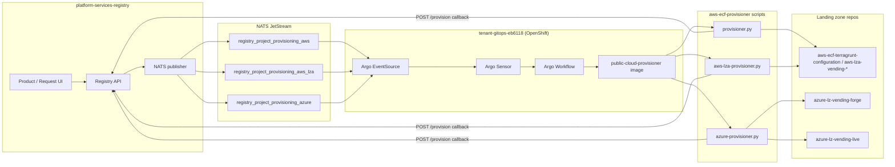
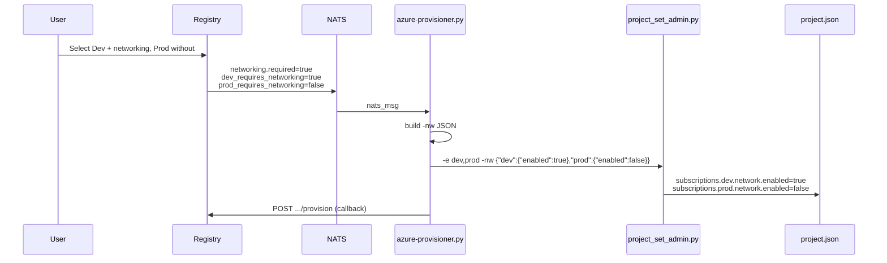

# Public Cloud Provisioning Architecture

Developer guide to how the **Platform Product Registry**, **NATS**, the **public cloud provisioner**, and the **AWS / Azure landing zone repos** work together.

For business-process workflows (eMOU, approvals, emails), see [Public Cloud Request Workflow](../business-logic/public-cloud/request-workflow.md).

---

## System overview

When a public cloud request is approved, the registry publishes a JSON message to NATS. An Argo Events pipeline in OpenShift picks up the message, runs the appropriate provisioner script inside a container, mutates a GitOps repo (Terraform/Terragrunt config), and calls back to the registry when done.



---

## Repositories and roles

| Repository                                                                                      | Role                                                                                                                                         |
| ----------------------------------------------------------------------------------------------- | -------------------------------------------------------------------------------------------------------------------------------------------- |
| [platform-services-registry](https://github.com/bcgov/platform-services-registry)               | UI, API, request workflow, NATS message creation, provision callback endpoint                                                                |
| [aws-ecf-provisioner](https://github.com/bcgov-c/aws-ecf-provisioner)                           | Provisioner scripts (`provisioner.py`, `aws-lza-provisioner.py`, `azure-provisioner.py`) and shared `lib.py`; baked into the OpenShift image |
| [tenant-gitops-eb6118](https://github.com/bcgov-c/tenant-gitops-eb6118)                         | Argo EventSources/Sensors, workflow templates, OpenShift BuildConfig for the provisioner image                                               |
| [aws-ecf-terragrunt-configuration](https://github.com/bcgov-c/aws-ecf-terragrunt-configuration) | AWS ECF project-set Terragrunt (cloned at runtime by `provisioner.py`)                                                                       |
| AWS LZA vending repos                                                                           | AWS LZA project-set config (cloned at runtime by `aws-lza-provisioner.py`)                                                                   |
| [azure-lz-vending-forge](https://github.com/bcgov-c/azure-lz-vending-forge)                     | Azure LZ **dev/test** project sets (`project.json`, Terraform); cloned when `repo_name=azure-lz-vending-forge`                               |
| [azure-lz-vending-live](https://github.com/bcgov-c/azure-lz-vending-live)                       | Azure LZ **prod** project sets; cloned when `repo_name=azure-lz-vending-live`                                                                |

The registry never talks to AWS or Azure directly for provisioning. It only publishes NATS messages and receives an HTTP callback when provisioning completes.

---

## When NATS messages are sent

NATS is **not** sent when a user saves form fields. It is sent when a request reaches an approved state:

| Trigger                      | Request type   | Notes                                    |
| ---------------------------- | -------------- | ---------------------------------------- |
| Admin approves CREATE/DELETE | CREATE, DELETE | After eMOU and billing steps             |
| User submits product edit    | EDIT           | Auto-approved; NATS sent immediately     |
| Billing review approval      | CREATE         | Some CREATE flows after billing sign-off |
| Admin resend                 | Any approved   | Re-triggers provisioning                 |

Implementation: `sendPublicCloudNatsMessage()` in `app/services/nats/index.ts`.

---

## NATS subjects and routing

The NATS subject is derived from the product **provider**:

```ts
registry_project_provisioning_${provider.toLowerCase()}
```

| Provider  | NATS subject                            | Provisioner script       |
| --------- | --------------------------------------- | ------------------------ |
| `AWS`     | `registry_project_provisioning_aws`     | `provisioner.py`         |
| `AWS_LZA` | `registry_project_provisioning_aws_lza` | `aws-lza-provisioner.py` |
| `AZURE`   | `registry_project_provisioning_azure`   | `azure-provisioner.py`   |

Each subject has a matching Argo EventSource in `tenant-gitops-eb6118` under `provisioner/overlays/{dev,test,prod}/`.

---

## NATS message shape

Built by `app/services/nats/public-cloud/index.ts`. The full JSON body is passed to the provisioner as the `nats_msg` environment variable (no schema filtering in gitops).

```json
{
    "project_set_info": {
        "licence_plate": "abc123",
        "ministry_name": "CITZ",
        "request_type": "CREATE",
        "project_name": "My Project",
        "account_coding": "...",
        "budgets": { "dev": 100, "test": 100, "prod": 200, "tools": 50 },
        "enterprise_support": { "prod": true, "test": false, "dev": false, "tools": false },
        "networking": {
            "required": true,
            "reason": "Private endpoints required"
        },
        "requested_environments": {
            "dev": true,
            "dev_requires_networking": true,
            "test": false,
            "test_requires_networking": false,
            "prod": true,
            "prod_requires_networking": false,
            "tools": false,
            "tools_requires_networking": false
        },
        "current_environments": { "...": "same shape, or null on CREATE" },
        "requested_product_owner": { "name": "...", "email": "...", "providerUserId": "..." },
        "requested_expense_authority": { "...": "..." },
        "requested_tech_leads": [{ "...": "..." }],
        "current_product_owner": null,
        "current_expense_authority": null,
        "current_tech_leads": null
    }
}
```

### Registry field → provisioner naming

| Registry (`environmentsEnabled`) | NATS (`requested_environments`) |
| -------------------------------- | ------------------------------- |
| `development`                    | `dev`                           |
| `test`                           | `test`                          |
| `production`                     | `prod`                          |
| `tools`                          | `tools`                         |
| `developmentRequiresNetworking`  | `dev_requires_networking`       |
| `testRequiresNetworking`         | `test_requires_networking`      |
| `productionRequiresNetworking`   | `prod_requires_networking`      |
| `toolsRequiresNetworking`        | `tools_requires_networking`     |

---

## OpenShift provisioner pipeline

Configured in [tenant-gitops-eb6118](https://github.com/bcgov-c/tenant-gitops-eb6118).

### 1. EventSource

Listens on the NATS subject (e.g. `registry_project_provisioning_azure`) and forwards the message body to a Sensor.

### 2. Sensor

Creates an Argo Workflow and injects the NATS body into workflow parameter `message`.

### 3. Workflow container

Runs inside the `public-cloud-provisioner` image with environment variables including:

| Variable                    | Purpose                                |
| --------------------------- | -------------------------------------- |
| `nats_msg`                  | Full JSON message from registry        |
| `org_name`                  | GitHub org (`bcgov-c`)                 |
| `repo_name`                 | Landing zone repo to clone (see below) |
| `layers`                    | Terragrunt/Terraform layers to apply   |
| `token`                     | GitHub token for clone/PR/merge        |
| `public_cloud_callback_url` | Registry base URL for callback         |
| SSO vars                    | Token for registry callback auth       |

**Environment-specific `repo_name` (Azure):**

| OpenShift overlay | `repo_name`              |
| ----------------- | ------------------------ |
| dev, test         | `azure-lz-vending-forge` |
| prod              | `azure-lz-vending-live`  |

### 4. Provisioner image

Built from `aws-ecf-provisioner` `main` via OpenShift BuildConfig (`provisioner-tools/buildconfig.public-cloud-provisioner.yaml`).

-   **Merge to `main`** triggers `push.yaml` → `oc start-build public-cloud-provisioner`
-   **GitHub release** does **not** rebuild; it tags existing `:latest` and opens a gitops PR to pin prod to `vX.Y`

Dev/test sensors use `:latest`. Prod uses a tagged image via kustomize after release.

---

## Provisioner behaviour by provider

All three scripts share `lib.py` for Git operations, environment parsing, and the registry callback.

### AWS (`provisioner.py`)

1. Clone `repo_name` (AWS ECF Terragrunt config)
2. Run `project_set_admin.py` to generate account/layer config
3. Open PR → wait for CI → merge → wait for apply workflow
4. `POST /api/v1/public-cloud/products/{licencePlate}/provision`

**Networking:** Not used. Registry sends `networking` fields as all-false for AWS; provisioner ignores them. No `-nw` flag.

### AWS LZA (`aws-lza-provisioner.py`)

Same pattern as AWS ECF against the LZA vending Terragrunt repo. Networking flags are likewise ignored.

### Azure (`azure-provisioner.py`)

1. Clone `azure-lz-vending-forge` (dev/test) or `azure-lz-vending-live` (prod)
2. Run `source/bin/project_set_admin.py` with CLI args derived from `nats_msg`
3. Open PR → wait for CI → merge → wait for apply workflow
4. Registry callback

**CREATE** (new project set): two-phase — subscriptions first (`layers=backend,main` default), then remaining layers.

**EDIT** (same accounts, metadata/networking change): updates existing `projects/{licencePlate}/project.json`.

**DELETE:** moves project directory to `projects-to-close/`.

---

## Azure networking (registry → `project.json`)

Networking is an **Azure-only** feature. The registry collects:

1. Project-level **Requires networking?** (`requiresNetworking` + `networkingReason`)
2. Per-account **Requires networking** checkboxes (`*RequiresNetworking`) — only when project-level is Yes and the account is selected

### Data flow



### Mapping rules (`lib.py` → `project_set_admin.py`)

| Registry                                 | `-nw` / `project.json`                                         |
| ---------------------------------------- | -------------------------------------------------------------- |
| `networking.required = false`            | All selected accounts → `network.enabled = false`              |
| `networking.required = true`             | Each account uses its `*_requires_networking` flag             |
| `networking.reason`                      | Stored in `project.json` tags as `networking_reason`           |
| No `networking` block in NATS (legacy)   | `-nw` omitted; new subs default to `network.enabled = true`    |
| **EDIT with unchanged networking flags** | **`-nw` omitted; existing `network.enabled` values preserved** |
| **Adding a new account only**            | `-nw` applies to the **new account only**, not existing subs   |

Legacy project sets may have `network.enabled: true` in Azure while the registry still has `requiresNetworking: false`. Non-networking edits (e.g. description changes) must not pass `-nw` or those values would be overwritten to `false`.

### Terminology

| Layer                | Name                | Example                                     |
| -------------------- | ------------------- | ------------------------------------------- |
| Registry / NATS      | `networking`        | User requirement                            |
| Azure `project.json` | `network`           | Infrastructure object                       |
| CLI flag             | `-nw` / `--network` | Bridge between provisioner and admin script |

---

## Registry callback

When provisioning succeeds, the provisioner calls:

```
POST {public_cloud_callback_url}/api/v1/public-cloud/products/{licencePlate}/provision
```

Authenticated with a service-account SSO token. The registry:

1. Marks the request `PROVISIONED`
2. Upserts `PublicCloudProduct` from `decisionData`
3. Sends completion emails

Route: `app/app/api/v1/public-cloud/products/[idOrLicencePlate]/provision/route.ts`

---

## Local development

| Component           | Local option                                                                                                           |
| ------------------- | ---------------------------------------------------------------------------------------------------------------------- |
| Registry            | [Running locally](./running-locally.md), [sandbox](./sandbox.md)                                                       |
| NATS                | Sandbox includes a mock NATS subscriber (`sandbox/nats-provision/`) that logs messages and hits the provision callback |
| Provisioner scripts | Run from `aws-ecf-provisioner` with `nats_msg` env var set to sample JSON                                              |
| Landing zone repos  | Cloned by provisioner at runtime; use forge for dev experimentation                                                    |

The sandbox provisioner does **not** run `project_set_admin.py` or mutate landing zone repos — it only demonstrates NATS → callback.

---

## Deployment checklist (networking or other provisioner changes)

1. Merge landing zone repo changes (e.g. `azure-lz-vending-forge` `-nw` support)
2. Merge `aws-ecf-provisioner` changes to `main` → confirm OpenShift build succeeds
3. E2E test in dev/test (`repo_name=azure-lz-vending-forge`, image `:latest`)
4. Port landing zone changes to `azure-lz-vending-live` before prod
5. Create a GitHub **release** on `aws-ecf-provisioner` to pin prod image tag via gitops PR

No gitops YAML changes are required for new NATS fields — the full message body is already forwarded as `nats_msg`.

---

## Troubleshooting

| Symptom                                                              | Likely cause                                                       |
| -------------------------------------------------------------------- | ------------------------------------------------------------------ |
| Request approved but product not provisioned                         | Argo workflow failed; check OpenShift workflow logs                |
| Azure provisioning fails on env names like `dev_requires_networking` | Old provisioner image; rebuild after `get_env_string` fix          |
| Networking choice ignored in Azure                                   | Forge/live missing `-nw` support, or old provisioner image         |
| AWS provisioning broken after registry networking release            | Unlikely if AWS flags are all false; check shared `lib.py` changes |
| Callback never received                                              | SSO secret misconfigured; workflow logs show callback HTTP status  |
| Prod still on old behaviour                                          | Prod uses tagged image, not `:latest`; need release + gitops merge |

---

## Related documentation

-   [Public Cloud Request Workflow](../business-logic/public-cloud/request-workflow.md) — approvals and emails
-   [Public Cloud eMOU Workflow](../business-logic/public-cloud/emou-workflow.md)
-   [Sandbox setup](./sandbox.md) — local NATS and mock provisioner
-   [aws-ecf-provisioner README](https://github.com/bcgov-c/aws-ecf-provisioner/blob/main/README.md) — provisioner env vars and NATS example
-   [azure-lz-vending-forge README](https://github.com/bcgov-c/azure-lz-vending-forge/blob/main/README.md) — `project.json` and networking schema
