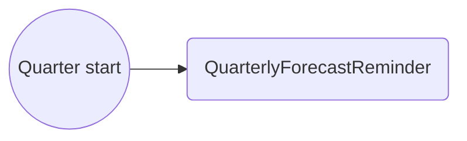
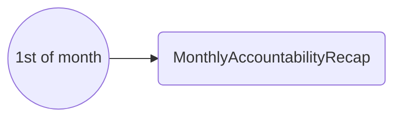

# Cloud Cost Email Scenarios

CHES email catalog for the [Cloud Cost Accountability epic](./cloud-cost.md). Follows the same documentation style as [Public Cloud email scenarios](../docs/business-logic/public-cloud/email-scenario.md).

Templates live in `app/emails/_templates/public-cloud/`. Send logic: `app/services/ches/public-cloud/accountability-emails.ts`.

## Status summary

| Scenario                        | Template file                             | Status |
| ------------------------------- | ----------------------------------------- | ------ |
| 1 — Quarterly forecast reminder | `QuarterlyForecastReminder.tsx`           | Done   |
| 2 — Weekly PO sign-off reminder | `QuarterlySignOffReminder.tsx`            | Done   |
| 3 — M+1 escalation              | `QuarterlyEscalation.tsx`                 | Done   |
| 4 — Consumption milestone       | `ConsumptionMilestone.tsx`                | Done   |
| 5 — Early pace warning          | `ConsumptionPaceWarning.tsx`              | Done   |
| 6 — A1 variance                 | `CostAlertA1.tsx`, `CostAlertA1Admin.tsx` | Done   |
| 7 — A2 variance                 | `CostAlertA2.tsx`, `CostAlertA2Admin.tsx` | Done   |
| 8 — A3 variance                 | `CostAlertA3.tsx`, `CostAlertA3Admin.tsx` | Done   |
| 9 — Monthly recap               | `MonthlyAccountabilityRecap.tsx`          | Done   |
| 10 — Forecast submitted         | `ForecastSubmitted.tsx`                   | Done   |
| 11 — Forecast rejected          | `ForecastRejected.tsx`                    | Done   |
| 12 — Non-compliance summary     | `NonComplianceSummary.tsx`                | Done   |
| 13 — Pre-emptive notice (A0)    | `PreemptiveThresholdNotice.tsx`           | Done   |

## Scenario 1: Quarterly forecast update reminder

**Trigger:** 1 Jan, 1 Apr, 1 Jul, 1 Oct (accountability jobs)
**Recipients:** Project PO, Technical Lead(s)

**Content:**

-   Product name and licence plate
-   Checklist: extend months 13–24, review 24-month forecast, review members, review 3-month spend, complete soft QR
-   Link to Forecast / Accountability page
-   Explanation language (what happens if non-compliant)

**Template:** `QuarterlyForecastReminder.tsx`

## Scenario 2: Weekly PO sign-off reminder

**Trigger:** Weekly while quarterly review incomplete (Mondays, accountability jobs)
**Recipients:** Project PO

**Content:**

-   Outstanding quarterly tasks checklist
-   Days until M+1 escalation
-   Link to sign-off action

**Template:** `QuarterlySignOffReminder.tsx`

## Scenario 3: M+1 escalation

**Trigger:** Quarterly work still incomplete one month after quarter start
**Recipients:** Director / ED (and PO copy optional)

**Content:**

-   Product and licence plate
-   Outstanding items
-   Link to compliance list

**Template:** `QuarterlyEscalation.tsx`

## Scenario 4: Consumption milestone notice

**Trigger:** CSP `CspConsumptionAlert` with `alertType: MILESTONE`
**Recipients:** Project PO, Technical Lead(s)

**Content:**

-   Milestone percent (50, 80, 100, 125, …)
-   Current spend, forecast, consumption percent
-   Link to update forecast or add explanation

**Template:** `ConsumptionMilestone.tsx`

## Scenario 5: Early pace warning

**Trigger:** CSP `CspConsumptionAlert` with `alertType: PACE`
**Recipients:** Project PO, Technical Lead(s)

**Content:**

-   Pace rule fired (e.g. 50% of forecast by day 10)
-   Spend to date vs forecast
-   Link to accountability page

**Template:** `ConsumptionPaceWarning.tsx`

## Scenario 6: A1 variance alert

**Trigger:** CSP alert `A1` (> +10% above forecast)
**Recipients:**

-   **Project:** PO, TL — prompt to update forecast
-   **Admin:** Platform admins

**Template:** `CostAlertA1.tsx`, `CostAlertA1Admin.tsx`

## Scenario 7: A2 variance alert

**Trigger:** CSP alert `A2` (> +50% OR > +$500)
**Recipients:**

-   **Project:** PO, TL
-   **Admin:** Platform admins, Cloud PO

**Template:** `CostAlertA2.tsx`, `CostAlertA2Admin.tsx`

## Scenario 8: A3 variance alert

**Trigger:** CSP alert `A3` (> +200% min +$500 OR > +$2,000)
**Recipients:**

-   **Project:** PO, TL
-   **Admin:** Platform admins, Cloud PO, Director of Cloud, Director of Finance

**Template:** `CostAlertA3.tsx`, `CostAlertA3Admin.tsx`

## Scenario 9: Monthly accountability recap

**Trigger:** 1st of each month (always)
**Recipients:** Cloud PO, Cloud Director, Finance Director — **one bundled email per recipient**

**Content:**

-   Table or list of Project Sets with: accountability status, open alert level, forecast compliance, escalation flag
-   Projects requiring action highlighted
-   Summary counts (open A1/A2/A3, non-compliant, escalated)

**Template:** `MonthlyAccountabilityRecap.tsx`

## Scenario 10: Forecast submitted for approval

**Status:** Done.

**Trigger:** PO submits initial or revised forecast
**Recipients:** `billing-reviewer` cohort

**Content:**

-   Product summary
-   Forecast version and horizon
-   Link to approve / reject in Registry

**Template:** `ForecastSubmitted.tsx` (implemented)

## Implementation notes

-   CHES integration: `app/services/ches/public-cloud/accountability-emails.ts`
-   **Admin / escalation routing (to be solved):** non-project recipients are hardcoded Keycloak global roles today, not configurable on the cost-rules page. Policy gap and options: [rules config — notification routing](./cloud-cost-rules-config.md#to-be-solved-admin-and-escalation-notification-routing)
-   Notification audit history (Story 7.5): **implemented** — all accountability CHES sends logged to `AccountabilityNotificationLog`; audit UI at `/public-cloud/accountability/audit`
-   Pre-emptive notice (CR-39 / A0): `PreemptiveThresholdNotice.tsx` on CSP consumption ingest
-   React Email previews: templates under `app/emails/_templates/public-cloud/`

## Related documents

-   [Cloud Cost workflows](./cloud-cost-workflows.md)
-   [Rules configuration](./cloud-cost-rules-config.md)
-   [Jira backlog mapping](./cloud-cost-jira-backlog.md)
-   [Public Cloud email scenarios](../docs/business-logic/public-cloud/email-scenario.md)
