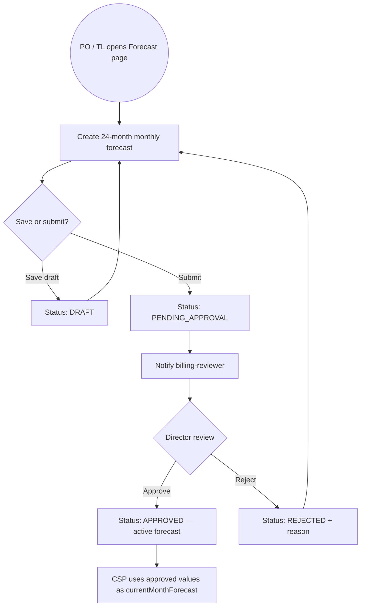
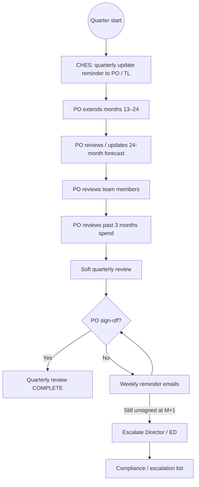
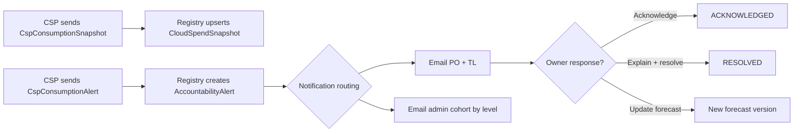
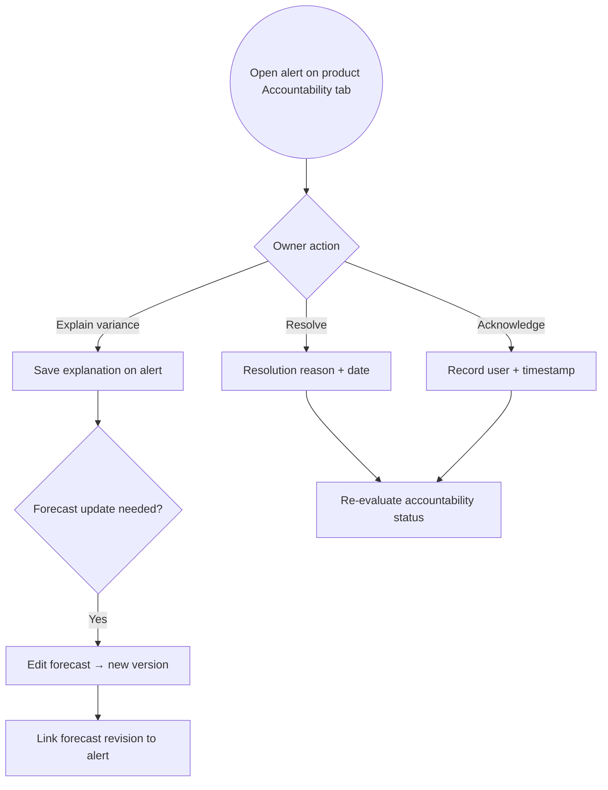
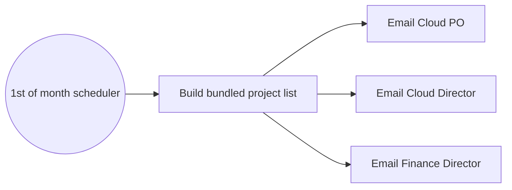

# Cloud Cost Workflows

Process diagrams for the [Cloud Cost Accountability epic](./cloud-cost.md). CSP spend ingest is assumed; see [data shapes](./cloud-cost-data-model.md#csp-data-contract).

## 1. Initial forecast lifecycle

First-time forecast for a Project Set (often aligned with product create or first quarter after provisioning).

Initial approval follows the same approver role as eMOU director review (`billing-reviewer`). See [eMOU workflow](../docs/business-logic/public-cloud/emou-workflow.md).

**Implementation note:** Approve, reject (Story 1.5), and Scenario 10 `ForecastSubmitted` email are **implemented**. See [Jira backlog mapping](./cloud-cost-jira-backlog.md).

## 2. Quarterly forecast update (1 Jan / Apr / Jul / Oct)

## 3. CSP consumption and alerts

Alert levels and recipients: [rules configuration](./cloud-cost-rules-config.md).

## 4. Variance response

## 5. Monthly admin recap (1st of month)

Content: open alerts, compliance gaps, escalations, significant variances — sent even if no alerts fired.

## Related documents

-   [Cloud Cost epic](./cloud-cost.md)
-   [Email scenarios](./cloud-cost-email-scenarios.md)
-   [UI specification](./cloud-cost-ui.md)
