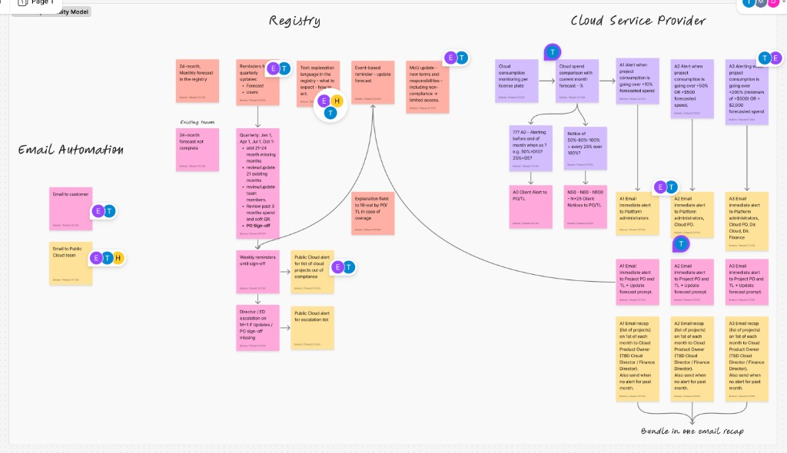
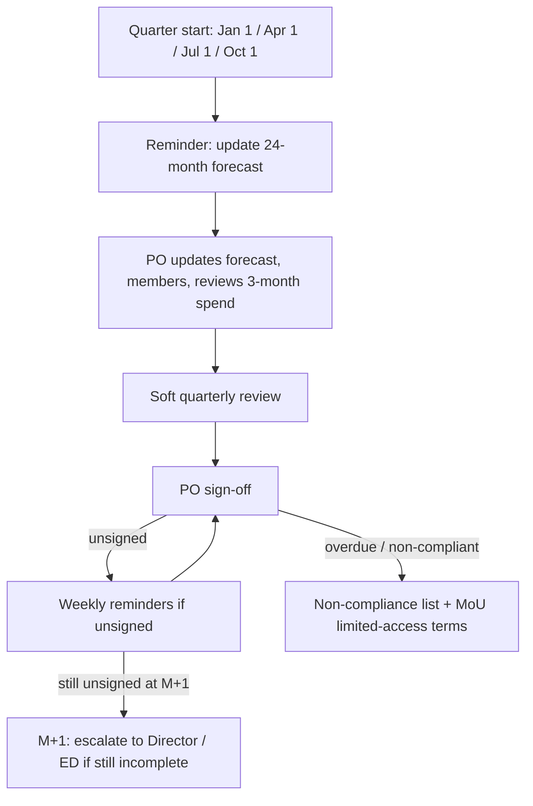
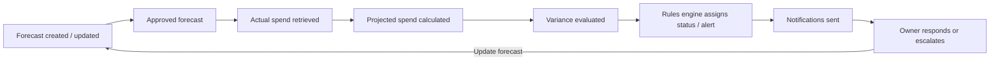

# Cloud Cost Accountability and Forecast Governance

Repo epic documentation (not published to MkDocs). Companion documents:

-   [Rules configuration](./cloud-cost-rules-config.md) — thresholds, schedules, escalation policy
-   [Data model and CSP shapes](./cloud-cost-data-model.md) — payloads, persistence, Prisma models
-   [Workflows](./cloud-cost-workflows.md) — forecast, quarterly review, alerts
-   [Email scenarios](./cloud-cost-email-scenarios.md) — CHES templates and triggers
-   [UI specification](./cloud-cost-ui.md) — routes, pages, components
-   [Jira backlog mapping](./cloud-cost-jira-backlog.md) — CR-1–CR-42 epics/stories vs implementation status

## Epic goal

Provide a centralized accountability framework that enables Project Owners, Technical Leads, Directors, and Finance stakeholders to forecast cloud spending, monitor actual consumption, identify variances, manage corrective actions, and maintain auditable governance across AWS and Azure Project Sets.

## Background

Public Cloud Project Sets incur ongoing spend that must be forecasted, approved, and monitored against actual consumption. The Registry already supports product provisioning, eMOU signing, and account coding for public cloud billing, and supports OpenShift namespace cost reporting for private cloud products. This epic extends the Registry into a full **forecast → spend → variance → action → escalation → audit** loop for public cloud accountability.

## Business workflow (governance whiteboard)

Source: Public Cloud cost accountability whiteboard (2026). Full image:



The workflow spans three systems:

| Pillar                     | Responsibility                                                                            |
| -------------------------- | ----------------------------------------------------------------------------------------- |
| **Registry**               | 24-month forecasts, quarterly reviews, PO sign-off, compliance lists, explanation capture |
| **Cloud service provider** | Per–licence plate consumption monitoring vs current-month forecast                        |
| **Email automation**       | Customer (project team) and Public Cloud team notifications via CHES                      |

Legend on the whiteboard: **E** = email, **T** = tooling/automation, **H** = human action.

### Registry — forecast and quarterly review

1. Maintain a **24-month monthly forecast** in the Registry for each Project Set.
2. On **1 Jan, 1 Apr, 1 Jul, and 1 Oct**, send reminders to update the forecast. Each quarterly cycle includes:
    - Add forecast months **13–24** (extend the rolling horizon)
    - Review and update the full **24-month forecast**
    - Review and update **team members**
    - Review **past three months of spend** and complete a **soft quarterly review (soft QR)**
    - Obtain **Product Owner sign-off**
3. Send **weekly reminders** until the PO signs off.
4. If updates or sign-offs are still missing by **M+1** (one month after the quarter start date), **escalate to Director / Executive Director**.
5. Include **explanation language** in the Registry so users know what to expect and how to respond.
6. Provide an **explanation field** for POs and Technical Leads when spend exceeds forecast.
7. **MoU update** (new terms): sustained non-compliance may result in **limited access** to Public Cloud services.
8. Surface a **Public Cloud compliance alert** listing projects out of compliance or on an escalation list.



### Cloud service provider — monitoring and alerts

Consumption is monitored **per licence plate** against the **current month’s forecast** (percentage and dollar variance).

| Alert                             | Trigger (business rules)                                                                                       |
| --------------------------------- | -------------------------------------------------------------------------------------------------------------- |
| **Consumption milestones**        | Notices to PO and TL at **50%, 80%, 100%** of forecast, then every **25%** thereafter                          |
| **Early pace warning (“777 AO”)** | Before month-end when pace is unusually high (example from whiteboard: **50% of forecast consumed by day 10**) |
| **A1**                            | Spend **> +10%** above forecasted spend                                                                        |
| **A2**                            | Spend **> +50%** above forecast **OR** **> +$500** above forecast                                              |
| **A3**                            | Spend **> +200%** above forecast (minimum **+$500**) **OR** **> +$2,000** above forecast                       |

Evaluate percentage and dollar rules; assign the **highest severity** that matches.

#### Immediate admin alerts

| Level | Recipients                                                                   |
| ----- | ---------------------------------------------------------------------------- |
| A1    | Platform admins                                                              |
| A2    | Platform admins + **Cloud PO**                                               |
| A3    | Platform admins + Cloud PO + **Director of Cloud** + **Director of Finance** |

#### Immediate project alerts

For **A1, A2, and A3**, email **Project PO** and **Technical Lead** with a prompt to **update the forecast** (and use the explanation field when applicable).

#### Monthly recap (1st of month)

Bundled email listing projects sent to **Cloud PO**, **Cloud Director**, and **Finance Director** — even when no alert fired that month.

Detailed thresholds and routing are configurable in [rules configuration](./cloud-cost-rules-config.md).

### In scope

-   Monthly cloud spend forecasts per Project Set (24-month rolling horizon)
-   Forecast lifecycle: draft, submit, approve, reject, quarterly review
-   Retrieval and display of actual AWS and Azure spend
-   Projected month-end spend and forecast variance calculation
-   Configurable alert thresholds (milestones, A1–A3) and accountability statuses
-   Variance response workflow (acknowledge, explain, resolve, update forecast)
-   Notifications and operational dashboards for project teams and administrators
-   Audit history for forecasts, approvals, alerts, escalations, and notifications

### Out of scope (initial epic)

-   Private Cloud OpenShift namespace cost accountability (see existing [private cloud costs UI](https://github.com/bcgov/platform-services-registry/tree/main/app/app/private-cloud/products))
-   Replacing finance systems of record for invoicing or payment
-   Automated cloud resource rightsizing or spend optimization recommendations

## Relationship to existing capabilities

| Area                  | Current state                                                                                                    | This epic                                                                    |
| --------------------- | ---------------------------------------------------------------------------------------------------------------- | ---------------------------------------------------------------------------- |
| Public cloud billing  | [eMOU workflow](../docs/business-logic/public-cloud/emou-workflow.md), account coding, expense authority signing | Adds forecast governance and spend accountability on top of billing metadata |
| Public cloud requests | [Request workflow](../docs/business-logic/public-cloud/request-workflow.md) for create/edit/delete               | Forecast compliance may gate or flag products independent of provisioning    |
| Private cloud costs   | Monthly/quarterly/yearly cost views with projection charts                                                       | Separate data source (OpenShift metrics); not part of this epic              |
| Notifications         | CHES email for requests and eMOU tasks                                                                           | Extends to forecast reminders, variance alerts, escalations, monthly recap   |

## Stakeholders

| Role                       | Primary interests                                                    |
| -------------------------- | -------------------------------------------------------------------- |
| Project Owner (PO)         | Maintain forecast; quarterly sign-off; respond to variances          |
| Technical Lead (TL)        | Support forecast accuracy; receive milestone and alert emails        |
| Expense Authority          | Sign eMOU; accountable for account coding                            |
| Cloud PO                   | Receives A2+ admin alerts and monthly recap                          |
| Director of Cloud          | A3 admin alerts; quarterly M+1 escalations; monthly recap            |
| Director of Finance        | A3 admin alerts; monthly recap                                       |
| Platform admin             | A1+ admin alerts; compliance and escalation lists                    |
| Public Cloud Administrator | Cross–Project Set governance dashboard                               |
| Finance                    | Audit trail, compliance reporting                                    |
| Auditor                    | Immutable history of forecasts, approvals, alerts, and notifications |

## Key concepts

| Term                  | Definition                                                                                       |
| --------------------- | ------------------------------------------------------------------------------------------------ |
| Project Set           | A public cloud product workspace (AWS or Azure) registered in the Registry                       |
| Forecast              | Expected monthly spend for a Project Set over a rolling 24-month horizon                         |
| Actual spend          | Cloud provider billing data aggregated for the Project Set                                       |
| Projected spend       | Estimated month-end total derived from spend-to-date and projection methodology                  |
| Variance              | Difference between forecast and actual or projected spend (dollar and percentage)                |
| Accountability status | Compliance label assigned to a Project Set (for example Compliant, Forecast Required)            |
| Alert level           | Severity tier when variance or consumption milestones are exceeded                               |
| Soft QR               | Lightweight quarterly review of past three months’ spend during forecast update                  |
| M+1 escalation        | Escalation to Director/ED when quarterly sign-off is still missing one month after quarter start |

Alert thresholds, milestone notices, review cadence, reminder timing, and escalation rules should be **configurable data**, not hard-coded application logic. See [rules configuration](./cloud-cost-rules-config.md).

## Implementation summary

MVP accountability features are **implemented** in the Registry. The table below contrasts the pre-epic baseline with what shipped.

| Area                  | Pre-epic baseline                                      | Shipped (this epic)                                                                   |
| --------------------- | ------------------------------------------------------ | ------------------------------------------------------------------------------------- |
| Budget estimates      | Per-env `product.budget` on create/edit; shown on eMOU | Versioned **24-month** `CloudCostForecast` with draft → submit → approve              |
| Spend actuals         | Not in Registry                                        | CSP ingest → `CloudSpendSnapshot`, `CloudSpendHistory`; costs page                    |
| Month-end projection  | Private cloud only (linear extrapolation)              | CSP `projectedMonthEnd` on consumption snapshot                                       |
| Forecast approval     | eMOU: EA signs → `billing-reviewer` reviews            | Same reviewer role for initial forecast approve; **PO sign-off** for quarterly review |
| Accountability status | None                                                   | Rules-driven `CloudCostAccountabilityState` + compliance list                         |
| Notifications         | Request / eMOU CHES only                               | Milestone, pace, A1–A3, quarterly, escalation, monthly recap                          |
| 80% budget warning    | Documented in request form only                        | Milestone emails at 50/80/100% of **approved forecast** (not `product.budget`)        |

**Shipped on accountability branch; partial items tracked in [Jira backlog mapping](./cloud-cost-jira-backlog.md).**

**Remaining gaps (summary):** CR-28 MoU legal update (deferred). Jira CR-1–CR-42 otherwise complete — see [Jira backlog mapping](./cloud-cost-jira-backlog.md).

Local demo: `pnpm run seed-accountability-local` — see [sandbox setup](../docs/development-setup/sandbox.md#seed-accountability-demo-data).

## Accountability loop



---

## Feature 1: Forecast management

### Story 1.1 — Create forecast

**As a** Project Owner
**I want to** create a cloud spend forecast for my Project Set
**So that** expected future spending is documented.

**Acceptance criteria**

-   Forecast can be created for a Project Set
-   Forecast supports monthly values
-   Forecast supports a rolling 24-month horizon
-   Forecast status is tracked
-   Creation date is recorded
-   Creator is recorded

### Story 1.2 — Update forecast

**As a** Project Owner
**I want to** update an existing forecast
**So that** forecast values remain accurate.

**Acceptance criteria**

-   Existing forecasts can be modified
-   Changes are versioned
-   Previous versions remain available
-   Update date is recorded
-   User performing update is recorded

### Story 1.3 — Submit forecast for approval

**As a** Project Owner
**I want to** submit a forecast for approval
**So that** accountability is formally established.

**Acceptance criteria**

-   Forecast status changes to Pending Approval
-   Approver is notified
-   Submission date is recorded

### Story 1.4 — Approve forecast

**As an** Approver
**I want to** approve a forecast
**So that** it becomes the active forecast.

**Acceptance criteria**

-   Forecast status changes to Approved
-   Approval date is recorded
-   Approver identity is recorded

### Story 1.5 — Reject forecast

**As an** Approver
**I want to** reject a forecast
**So that** corrections can be made.

**Acceptance criteria**

-   Forecast status changes to Rejected
-   Rejection reason is captured
-   Project Owner is notified

### Story 1.6 — Complete quarterly forecast review

**As a** Project Owner
**I want to** complete the quarterly forecast update and sign-off
**So that** forecast compliance requirements are satisfied.

**Acceptance criteria** (from governance whiteboard)

-   Quarterly reminder fires on **1 Jan, 1 Apr, 1 Jul, 1 Oct**
-   PO can extend forecast months **13–24** and review/update the full **24-month forecast**
-   PO can review and update **team members** on the product
-   PO can review **past three months of spend** and complete **soft QR**
-   **PO sign-off** is recorded with date and identity
-   **Weekly reminders** sent until sign-off is complete
-   If still incomplete at **M+1**, escalate to **Director / ED**

---

## Feature 2: Cost accountability

### Story 2.1 — Retrieve actual cost for Project Set

**As the** Registry
**I want to** retrieve actual cloud spend associated with a Project Set
**So that** forecast variance can be calculated.

**Acceptance criteria**

-   AWS spend is supported
-   Azure spend is supported
-   Historical spend is retained
-   Refresh schedule is configurable

### Story 2.2 — Display current month spend

**As a** Project Owner
**I want to** view current month spend
**So that** I understand my financial position.

**Acceptance criteria**

-   Current spend is visible
-   Spend is aggregated across accounts/subscriptions
-   Refresh date is displayed

### Story 2.3 — Calculate projected month-end spend

**As the** Registry
**I want** projected spend calculated
**So that** forecast overruns can be detected early.

**Acceptance criteria**

-   Projection is calculated automatically
-   Projection date is retained
-   Projection methodology is configurable

### Story 2.4 — Calculate forecast variance

**As the** Registry
**I want** actual and projected spend compared against forecast
**So that** governance rules can be evaluated.

**Acceptance criteria**

-   Dollar variance calculated
-   Percentage variance calculated
-   Historical variances retained

### Story 2.5 — Display cost accountability status

**As a** Project Owner
**I want to** see accountability status
**So that** I know whether action is required.

**Acceptance criteria**

-   Forecast displayed
-   Actual spend displayed
-   Projected spend displayed
-   Variance displayed
-   Alert level displayed
-   Outstanding actions displayed

---

## Feature 3: Responsibility rules engine

### Story 3.1 — Detect missing forecast

**As the** Registry
**I want** missing forecasts detected
**So that** compliance can be enforced.

### Story 3.2 — Detect stale forecast

**As the** Registry
**I want** stale forecasts detected
**So that** forecast information remains current.

### Story 3.3 — Detect missing quarterly review

**As the** Registry
**I want** missing quarterly reviews detected
**So that** accountability obligations are met.

### Story 3.4 — Evaluate forecast variance thresholds

**As the** Registry
**I want** forecast variances evaluated
**So that** alert levels can be assigned.

**Acceptance criteria**

-   A1 evaluated (> +10% above forecast)
-   A2 evaluated (> +50% OR > +$500 above forecast)
-   A3 evaluated (> +200% with min +$500 OR > +$2,000 above forecast)
-   Consumption milestones evaluated (50%, 80%, 100%, +25% steps)
-   Early pace rules evaluated (configurable; example 50% by day 10)
-   Thresholds configurable

### Story 3.5 — Assign accountability status

**As the** Registry
**I want** Project Sets assigned accountability status
**So that** compliance can be measured.

**Acceptance criteria**

Supported statuses:

-   Compliant
-   Forecast Required
-   Forecast Review Required
-   Variance Review Required
-   Escalated

### Story 3.6 — Evaluate escalation conditions

**As the** Registry
**I want** escalation conditions evaluated
**So that** unresolved issues are elevated.

**Acceptance criteria**

-   Escalation rules configurable
-   Escalation history retained

---

## Feature 4: Variance response management

### Story 4.1 — Acknowledge alert

**As a** Project Owner
**I want to** acknowledge an alert
**So that** the Registry knows I am aware of the issue.

**Acceptance criteria**

-   Alert can be acknowledged
-   User recorded
-   Timestamp recorded

### Story 4.2 — Provide variance explanation

**As a** Project Owner
**I want to** explain a variance
**So that** stakeholders understand why costs differ from forecast.

**Acceptance criteria**

-   Explanation captured
-   Explanation retained
-   Linked to variance event

### Story 4.3 — Resolve variance alert

**As a** Project Owner
**I want to** resolve an alert
**So that** accountability status reflects corrective action.

**Acceptance criteria**

-   Resolution reason recorded
-   Resolution date retained

### Story 4.4 — Update forecast following variance

**As a** Project Owner
**I want to** update my forecast after a significant variance
**So that** future expectations remain accurate.

**Acceptance criteria**

-   Updated forecast linked to variance event

---

## Feature 5: Notifications

### Story 5.1 — Quarterly forecast update reminder

**As the** Registry
**I want** quarterly forecast update reminders sent on quarter start
**So that** forecasts remain current.

**Acceptance criteria**

-   Reminder on **1 Jan, 1 Apr, 1 Jul, 1 Oct**
-   Includes checklist: extend months 13–24, review 24-month forecast, members, 3-month spend, soft QR

### Story 5.2 — Weekly PO sign-off reminder

**As the** Registry
**I want** weekly reminders until PO sign-off is complete
**So that** quarterly accountability is not delayed.

### Story 5.3 — M+1 escalation notification

**As the** Registry
**I want** escalations sent when quarterly work is still incomplete at M+1
**So that** Director / ED visibility is obtained.

### Story 5.4 — Send consumption milestone notification

**As the** Registry
**I want** milestone and early-pace notifications sent
**So that** Project Owners can proactively respond before A1–A3 alerts.

**Acceptance criteria**

-   Milestones at 50%, 80%, 100%, and every 25% beyond 100%
-   Early pace warnings (configurable; example 50% by day 10)
-   Email Project PO and Technical Lead

### Story 5.5 — Send A1 alert notification

**As the** Registry
**I want** variance notifications sent
**So that** corrective action can begin.

### Story 5.6 — Send A2 alert notification

**As the** Registry
**I want** significant variance notifications sent
**So that** accountability is enforced.

### Story 5.7 — Send A3 alert notification

**As the** Registry
**I want** critical variance notifications sent
**So that** executive attention is obtained.

### Story 5.8 — Send escalation notification

**As the** Registry
**I want** escalation notifications sent
**So that** management is aware of unresolved issues.

### Story 5.9 — Generate monthly accountability recap

**As the** Registry
**I want** monthly summary reports distributed
**So that** stakeholders understand overall compliance.

**Acceptance criteria**

-   Sent on the **1st of each month**
-   **Bundled single email** per recipient cohort
-   Recipients: **Cloud PO**, **Cloud Director**, **Finance Director**
-   Includes open alerts, forecast compliance, escalations, significant variances, and projects requiring action
-   Sent even when no alerts fired in the prior month

---

## Feature 6: Dashboards and reporting

### Story 6.1 — Project Owner dashboard

**As a** Project Owner
**I want to** see accountability information for my Project Sets
**So that** I can manage my responsibilities.

### Story 6.2 — Public Cloud Team dashboard

**As a** Cloud Administrator
**I want to** see governance status across all Project Sets
**So that** I can prioritize interventions.

### Story 6.3 — Director dashboard

**As a** Director
**I want to** see accountability information for my portfolio
**So that** I can manage organizational risk.

### Story 6.4 — Executive dashboard

**As an** Executive
**I want** portfolio-level accountability reporting
**So that** I can understand overall governance health.

---

## Feature 7: Audit and compliance

### Story 7.1 — Forecast audit history

**As an** Auditor
**I want** forecast changes retained
**So that** forecast evolution can be reviewed.

### Story 7.2 — Approval audit history

**As an** Auditor
**I want** forecast approvals retained
**So that** governance decisions can be verified.

### Story 7.3 — Alert audit history

**As an** Auditor
**I want** alert history retained
**So that** accountability actions can be reviewed.

### Story 7.4 — Escalation audit history

**As an** Auditor
**I want** escalation history retained
**So that** governance compliance can be demonstrated.

### Story 7.5 — Notification audit history

**As an** Auditor
**I want** notification history retained
**So that** stakeholder communications can be verified.

---

## Implementation status

Track progress here (no separate GitHub issues). **Jira keys (CR-1–CR-42)** are mapped in [cloud-cost-jira-backlog.md](./cloud-cost-jira-backlog.md).

| Area                             | Status   | Jira / story | Notes                                                                                                                               |
| -------------------------------- | -------- | ------------ | ----------------------------------------------------------------------------------------------------------------------------------- |
| Prisma models                    | Done     | CR-18        | `CloudCostForecast`, `CloudSpendSnapshot`, `AccountabilityAlert`, `AccountabilityNotificationLog`, etc.                             |
| CSP ingest APIs                  | Done     | CR-29        | `PUT /api/internal/csp/consumption`, `POST /api/internal/csp/alerts`, `PUT /api/internal/csp/consumption/history` (service account) |
| Forecast CRUD + approve + reject | Done     | CR-15–18     | Draft, submit, approve, reject routes + UI                                                                                          |
| Forecast grid UX                 | Done     | CR-1–CR-14   | Fiscal FY grid, provider labels, save modal, bulk edit, grand total direction                                                       |
| Quarterly review API             | Done     | CR-19        | GET/PUT/POST sign-off                                                                                                               |
| Quarterly jobs + emails          | Done     | CR-20–CR-27  | Reminders, weekly sign-off, non-compliance + escalation-list emails; configurable routing                                           |
| Alert acknowledge / resolve      | Done     | CR-17        | Product-scoped routes; overage explanation required for A1+                                                                         |
| Accountability UI tab            | Done     | CR-1         | Forecast grid, quarterly checklist, alert modals, audit history tabs                                                                |
| Product costs page               | Done     | CR-2, CR-40  | Provider-specific titles; `/costs/history` route                                                                                    |
| Actuals vs forecast              | Done     | CR-30–CR-31  | Actual row in grid, consumption %, CSP history                                                                                      |
| Admin governance dashboard       | Done     | CR-23        | `/public-cloud/accountability/all`, compliance, director, executive, audit                                                          |
| Rules config admin UI            | Done     | CR-39        | Cost rules + A0 thresholds + notification routing                                                                                   |
| CHES email templates             | Done     | CR-32–CR-39  | Milestone, pace, A0, A1–A3, quarterly, escalation, escalation list, monthly recap, forecast submitted/rejected                      |
| Notification audit               | Done     | 7.5          | `AccountabilityNotificationLog`; `/public-cloud/accountability/audit`                                                               |
| Audit history UI                 | Done     | 7.1–7.4      | `AccountabilityAuditHistory` on product tab + notification audit page                                                               |
| Export                           | Done     | CR-41–CR-42  | Excel (default) + CSV via `format` param                                                                                            |
| Scheduled accountability jobs    | Done     | CR-19–CR-21  | Airflow DAGs enabled on create → `POST /api/internal/accountability/jobs`                                                           |
| API tests                        | Done     | —            | `app/api/public-cloud/accountability.test.ts`                                                                                       |
| Production deploy                | Done     | —            | Airflow DAGs unpaused on create (dev/test/prod); CSP + CHES per environment                                                         |
| Admin notification routing       | Done     | CR-22, CR-36 | `notificationRouting` on cost-rules admin UI; Keycloak fallback when lists empty                                                    |
| MoU limited access enforcement   | Deferred | CR-28        | MoU allows it; **not** implemented in Registry — manual ops only if needed                                                          |

### Local setup after pull

```sh
cd app
pnpm exec dotenv -e .env.local -- prisma db push
pnpm exec dotenv -e .env.local -- prisma generate
```

Sandbox must be running (`make localmac SBD=true`). Apply schema to local MongoDB before using accountability features.

## MVP scope

Recommended MVP stories — **delivered** on the accountability branch except items marked partial/deferred. See [Jira backlog mapping](./cloud-cost-jira-backlog.md) for CR keys.

| Feature             | Stories              | Status |
| ------------------- | -------------------- | ------ |
| Forecast management | 1.1–1.4, 1.6         | Done   |
| Forecast reject     | 1.5                  | Done   |
| Cost accountability | 2.1–2.5              | Done   |
| Rules engine        | 3.1–3.6              | Done   |
| Variance response   | 4.1–4.3              | Done   |
| Notifications       | 5.1–5.9, Scenario 10 | Done   |
| Dashboards          | 6.1–6.4              | Done   |
| Audit               | 7.1–7.5              | Done   |
| Export (Jira)       | CR-41, CR-42         | Done   |

Deferred / out of scope:

-   **CR-28** — MoU legal/content update (policy process outside Registry)
-   Story **4.4** — Forecast update linked to variance event (internal; not in Jira CSV)
-   MoU **limited access** enforcement — manual ops only

## Implementation phases

Phases **1–7 complete** on the accountability branch. See [Jira backlog mapping](./cloud-cost-jira-backlog.md).

1. Rules configuration — done (including notification routing)
2. Forecast CRUD and approval — done (including reject)
3. CSP ingest endpoints — done
4. Alerts, notifications, dashboards — done
5. Quarterly review + jobs — done (Airflow DAGs enabled on create)
6. Director / executive dashboards — done
7. Audit — done (product tabs + notification audit page)
8. Export — done (Excel + CSV)

## Story tracking

Use these titles when creating GitHub issues (epic label: `cloud-cost`).

| ID        | Suggested issue title                                    | Feature        |
| --------- | -------------------------------------------------------- | -------------- |
| 1.1       | Create monthly cloud spend forecast for Project Set      | Forecast       |
| 1.2       | Version forecast updates with audit history              | Forecast       |
| 1.3       | Submit forecast for approval                             | Forecast       |
| 1.4       | Approve forecast and activate as current                 | Forecast       |
| 1.6       | Quarterly forecast update, soft QR, and PO sign-off      | Forecast       |
| 2.1       | Ingest AWS and Azure actual spend per Project Set        | Accountability |
| 2.2       | Display current month spend on product costs page        | Accountability |
| 2.3       | Calculate projected month-end spend                      | Accountability |
| 2.4       | Calculate and store forecast variance                    | Accountability |
| 2.5       | Display accountability status on product page            | Accountability |
| 3.1–3.6   | Rules engine: compliance detection and status assignment | Rules          |
| RC.1–RC.3 | Admin rules configuration UI with versioning             | Rules config   |
| 4.1–4.3   | Variance alert acknowledge, explain, resolve             | Response       |
| 5.4       | Consumption milestones and early pace notifications      | Notifications  |
| 5.5–5.8   | A1–A3 and escalation email notifications                 | Notifications  |
| 5.9       | Monthly bundled accountability recap (1st of month)      | Notifications  |
| 6.1       | Project Owner accountability dashboard                   | Dashboards     |
| 6.2       | Public Cloud admin governance dashboard                  | Dashboards     |
| 7.1–7.5   | Audit history for forecasts, alerts, notifications       | Audit          |

## Future work

Rules configuration is documented in [cloud-cost-rules-config.md](./cloud-cost-rules-config.md). Remaining epic items deferred from MVP are listed above.

### Open questions

| Question                             | Status                      | Notes                                                                                                                                                                                         |
| ------------------------------------ | --------------------------- | --------------------------------------------------------------------------------------------------------------------------------------------------------------------------------------------- |
| Source of truth for AWS/Azure spend  | **Assumed**                 | CSP delivers shapes in [data model](./cloud-cost-data-model.md#csp-data-contract)                                                                                                             |
| Month-end projection methodology     | **CSP-provided**            | `projectedMonthEnd` on `CspConsumptionSnapshot`                                                                                                                                               |
| Quarterly forecast approver          | **Confirmed**               | **PO sign-off** each quarter; M+1 escalation to Director/ED                                                                                                                                   |
| A1–A3 thresholds                     | **Confirmed**               | See [business workflow](#cloud-service-provider--monitoring-and-alerts) and [rules config](./cloud-cost-rules-config.md)                                                                      |
| Notification routing                 | **To be solved**            | Whiteboard roles vs Keycloak roles; global vs org-scoped M+1 — see [rules config — notification routing](./cloud-cost-rules-config.md#to-be-solved-admin-and-escalation-notification-routing) |
| eMOU budget vs monthly forecast      | **Proposed**                | Separate models; optional seed from `product.budget`                                                                                                                                          |
| Non-compliance enforcement           | **Out of scope (Registry)** | MoU terms allow **limited access**; Registry does not enforce — manual ops only                                                                                                               |
| Spend data feed from CSP to Registry | **Implemented**             | `PUT /api/internal/csp/consumption`, `POST /api/internal/csp/alerts`, `PUT /api/internal/csp/consumption/history`                                                                             |
